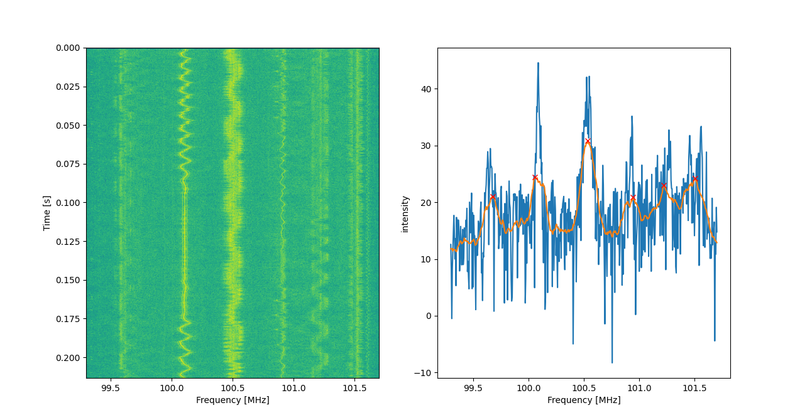
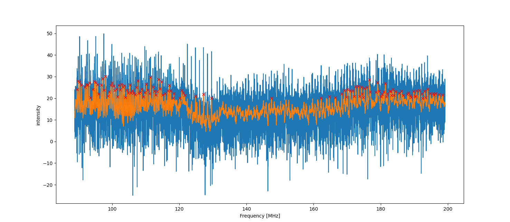

# rtl test journal 
## fm part
play fm radio by cli 
```bash 
rustam@nb-ubuntu-02:~/IP_edu/rtl_journal$ rtl_fm -M wbfm -f 100.5M -r 48k  - | aplay -r 24000 -f S16_LE -t raw -c 2
Found 1 device(s):
Playing raw data 'stdin' : Signed 16 bit Little Endian, Rate 24000 Hz, Stereo
  0:  Realtek, RTL2838UHIDIR, SN: 00000001

Using device 0: Generic RTL2832U OEM
Found Rafael Micro R820T tuner
Tuner gain set to automatic.
Tuned to 100771000 Hz.
Oversampling input by: 6x.
Oversampling output by: 1x.
Buffer size: 8.03ms
Exact sample rate is: 1020000.026345 Hz
Sampling at 1020000 S/s.
Output at 170000 Hz.
underrun!!! (at least 126,737 ms long)
```
for mono play
```bash 
rustam@nb-ubuntu-02:~/IP_edu/rtl_journal$ rtl_fm -M wbfm -f 100.5M -r 48k  - | aplay -r 48000 -f S16_LE -t raw -c 1
Playing raw data 'stdin' : Signed 16 bit Little Endian, Rate 48000 Hz, Mono
Found 1 device(s):
  0:  Realtek, RTL2838UHIDIR, SN: 00000001

Using device 0: Generic RTL2832U OEM
Found Rafael Micro R820T tuner
Tuner gain set to automatic.
Tuned to 100771000 Hz.
Oversampling input by: 6x.
Oversampling output by: 1x.
Buffer size: 8.03ms
Exact sample rate is: 1020000.026345 Hz
Sampling at 1020000 S/s.
Output at 170000 Hz.
underrun!!! (at least 125,732 ms long)
```
save and play 
```bash 
rustam@nb-ubuntu-02:~/IP_edu/rtl_journal$ rtl_fm -M wbfm -f 100.5M -r 48k  out_fm.raw
Found 1 device(s):
  0:  Realtek, RTL2838UHIDIR, SN: 00000001

Using device 0: Generic RTL2832U OEM
Found Rafael Micro R820T tuner
Tuner gain set to automatic.
Tuned to 100771000 Hz.
Oversampling input by: 6x.
Oversampling output by: 1x.
Buffer size: 8.03ms
Exact sample rate is: 1020000.026345 Hz
Sampling at 1020000 S/s.
Output at 170000 Hz.
^CSignal caught, exiting!

User cancel, exiting...
rustam@nb-ubuntu-02:~/IP_edu/rtl_journal$ aplay -r 48000 -f S16_LE -t raw -c 1 out_fm.raw 
Playing raw data 'out_fm.raw' : Signed 16 bit Little Endian, Rate 48000 Hz, Mono
```
## raw sdr
```bash
rustam@nb-ubuntu-02:~/IP_edu/rtl_journal$ rtl_sdr -f 100.5M -n 10000  out_sdr.bin
Found 1 device(s):
  0:  Realtek, RTL2838UHIDIR, SN: 00000001

Using device 0: Generic RTL2832U OEM
Found Rafael Micro R820T tuner
[R82XX] PLL not locked!
Sampling at 2048000 S/s.
Tuned to 100500000 Hz.
Tuner gain set to automatic.
Reading samples in async mode...

User cancel, exiting...

```
## python sample
```bash
pip install poetry==1.2
poetry install
```
[simple script](rtl_journal/fft_show.py) 


[scan fm in range](rtl_journal/scan_fm.py) 

```bash
x_plots[peaks]=array([ 89.52798434,  89.88962818,  90.28414873,  90.76790607,
        91.91389432,  92.31780822,  92.67945205,  93.19608611,
        93.54363992,  94.31389432,  94.71780822,  95.13581213,
        95.61017613,  95.98121331,  96.70450098,  97.11780822,
        97.55459883,  97.97260274,  98.83679061,  99.07632094,
        99.57886497,  99.94990215, 100.41017613, 100.8       ,
       101.22739726, 101.61252446, 102.02113503, 102.40626223,
       102.80547945, 103.20469667, 103.60391389, 103.99373777,
       104.37886497, 104.80626223, 105.24305284, 105.60469667,
       105.99921722, 106.39843444, 106.85401174, 107.2109589 ,
       107.6665362 , 108.        , 108.42270059, 108.76555773,
       109.31506849, 109.72367906, 110.16046967, 110.65362035,
       111.12328767, 111.39569472, 112.14246575, 112.61213307,
       113.03483366, 113.38708415, 113.81448141, 114.22778865,
       114.63170254, 115.02152642, 115.76829746, 116.59960861,
       116.99882583, 117.44031311, 118.12133072, 118.37964775,
       120.0704501 , 120.72328767, 121.18825832, 121.61565558,
       124.81878669, 127.21409002, 129.58121331, 147.44735812,
       162.25127202, 164.66536204, 166.39373777, 168.35694716,
       169.19295499, 169.8035225 , 170.13228963, 170.91193738,
       171.70567515, 172.14716243, 172.49941292, 173.38238748,
       173.762818  , 174.22778865, 174.47201566, 174.77260274,
       175.06849315, 175.918591  , 176.60900196, 176.84383562,
       178.60039139, 179.04657534, 179.49745597, 180.16908023,
       180.40861057, 180.97690802, 181.4183953 , 181.69080235,
       181.95851272, 182.74285714, 182.9776908 , 183.21722114,
       183.63522505, 183.90763209, 184.4853229 , 185.47632094,
       186.21369863, 186.73502935, 187.95616438, 188.31780822,
       188.85322896, 189.13502935, 189.8630137 , 190.24344423,
       190.47827789, 190.72250489, 191.53502935, 192.27240705,
       192.5260274 , 193.13189824, 193.37612524, 193.99608611,
       194.76634051, 195.63052838, 195.90293542, 196.44774951,
       197.46692759, 198.4297456 ])
```